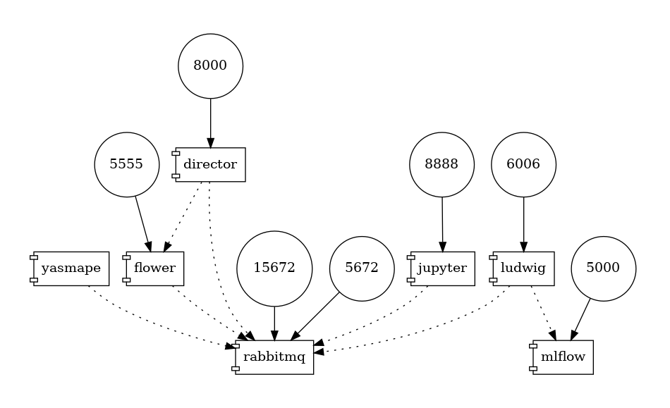

# YASMaPE

YASMaPE stands for _Yet another stock market prediction experiment_.

Technically, this project is an practical exercise in machine learning (ML) system engineering. It is about to play around with powerful tools and to experiment with ML systems designs. 

The stock market supplies time series data as input to this project. This is highly attractive: fresh as well as historical time series data is available and standardized, but the data generating process is hidden and unveils surprisingly complex behaviors. 

**Disclaimer:** This project is highly experimental. Do not use for investment decisions.

## Project Information

In this project, we want to evaluate chart indicators for stock recommendations. Chart indicators are empirical hearsay and popular folklore about the stock market. There is neither a scientific foundation nor a derivation from first principles. 

As a consequence, our analysis is purely based on statistical correlations of stock prices with these indicators. We aim to exploit the situation that _sometimes_ these correlations turn out to be useful. So, for a stock recommendation we formulate the following prediction problem.

> **Prediction Problem:** When do today's indicators correlate with future returns?

Further, we aim at traders with a low budget. This constraints our recommendations as follows:

1. single stock investments over diversified portfolios
1. long-term return over short-term decisions
1. buy/sell delays over intraday trading

As a result, we formulate the project goal.

> **Goal:** Enable a solution approach for the prediction problem in an application contrained by budget, diversity and delays.


## Technical Approach

The project's experiments compile features from 70+ chart indicators for a stock and use Uber's deep learning framework [Ludwig](https://ludwig-ai.github.io/ludwig-docs/) to make predictions. In the refined prediction problem, we formulate regressions and classifications problems involving

* returns across various horizons
* return larger than a given threshold

YASMaPE is [multi-container Docker application](https://docs.docker.com/compose/). Each container runs idempotent workflows implemented using [snakemake](https://snakemake.readthedocs.io/en/stable/). Distributed coordination across containers is supported by [celery](https://docs.celeryq.dev/en/stable/index.html). 


## Documentation

Please see [`docs`](docs) folder for an extensive documentation 

## Dev System

We provide a `docker-compose` file to setup a multi-container application composed of containers as microservices, which are loosely coupled by a distributed task queue. The diagram below depicts the containers, their dependencies and ports (number in circles). The diagram sources from this [medium.com article](https://medium.com/@krishnakummar/creating-block-diagrams-from-your-docker-compose-yml-da9d5a2450b4).




**Setup:** Start in project's root dir and create a `.env` file with the content shown below.
```
# .env file

# In the container, this is the directory where the code is found
# Example:
APP_ROOT=/YASMaPE

# the HOST directory containing directories to be mounted into containers
# Example:
VOL_DIR=/dev/YASMaPE
```

**Create** docker image. Please see [Dockerfiles/](Dockerfiles directory) for details.

```bash
docker-compose build yasmape
```

**Spin up** the container and get a shell from the container
```bash
docker-compose up -d yasmape
docker exec -it yasmape /bin/bash
```

## License

Information provided in the [LICENSE](LICENSE) file.
