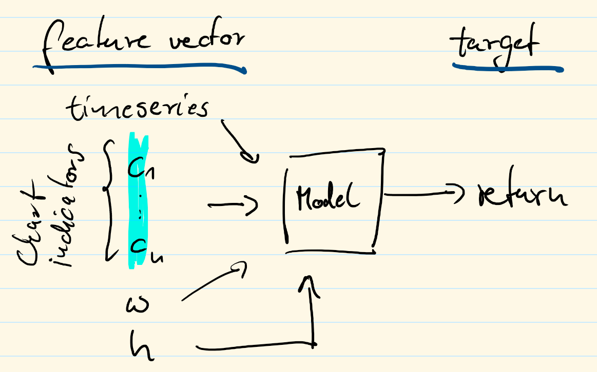
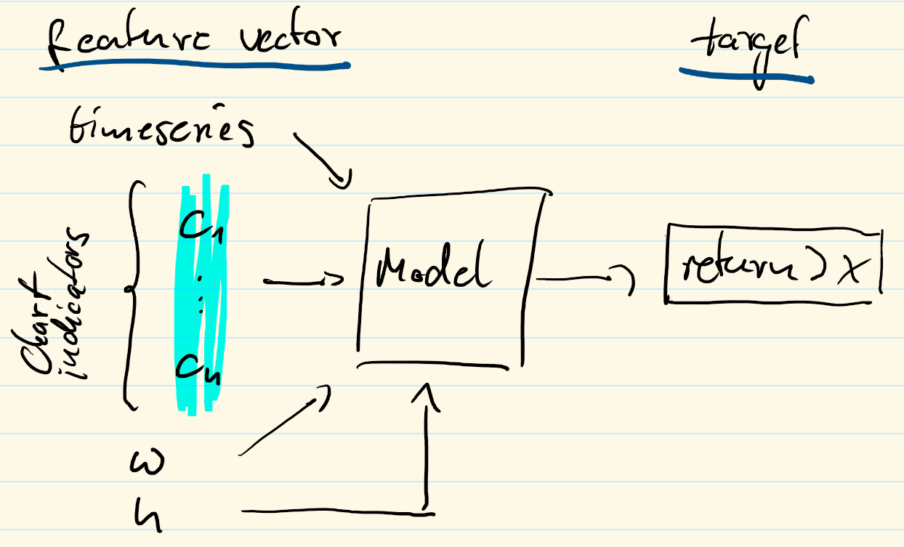

# YASMaPE Documentation 

This page collects all documentation ressource for YASMaPE. The project heavily utilizes the [convention over configuration](https://en.wikipedia.org/wiki/Convention_over_configuration) software design paradigm. The subsections explain the practiced conventions.

* [YASMaPE Problem Formulation](#yasmape-problem-formulation)
* [Results](#results)
* [Feature Engineering](#feature-engineering)
* [Machine Learning (ML) Pipeline](#machine-learning-ml-pipeline)
  * [Coordination across Containers](#coordination-across-containers)
  * [Orchestration](#orchestration)
  * [Task Concurrency and Pipeline Scaling](#task-concurrency-and-pipeline-scaling)
* [Model Training using ludwig](#model-training-using-ludwig)
* [Model Lifecylce Management using mflow](#model-lifecylce-management-using-mflow)
* [Modelcards](#modelcards)
* [Versioning](#versioning)
* [Testing and Explainability](#testing-and-explainability)
* [Gist](#gist)

<!-- Created by https://github.com/ekalinin/github-markdown-toc -->

## YASMaPE Problem Formulation

YASMaPE experiments investigate a regression and a classification problem. Both are illustrated below.

**Regression problem:** Given the input feature vector, what is the predicted return?



**Binary classification problem:** Given the input feature vector, is the predicted return larger than a given value?



## Results

We will track results on a [separate page](results.md) using [modelcards](https://www.verifyml.com/).

## Feature Engineering

The [`create_feature` notebook](../notebooks/create_feature.ipynb) implements the feature engineering. It creates two [parquet](https://parquet.apache.org/) files:

* `train_set.parquet`
* `eval_set.parquet`


_windowing, etc._


## Machine Learning (ML) Pipeline

The pipeline's stages is shown as an activity diagram in the next figure.


The software parts run independently in docker containers. They share their data via the filesystem. For coordination among the containers, they setup tasks queues using [celery](https://docs.celeryq.dev/en/stable/) as a distributed task queuing system. A [snakemake](https://snakemake.readthedocs.io/en/stable/) installation within each container executes the tasks consumed from the queue. Tasks become idempotent with snakemake.

The following UML component diagram shows the project's ML pipeline. 


YASMaPE runs lots of experiments. We use [mlflow](https://mlflow.org/) for ML lifecycle management and experiment tracking.

> Convention: Queues are named according to the scheme `q_{container name}.{task_name}`.

### Coordination across Containers

Software components run in docker containers. Coordination runs task distributed [celery](https://docs.celeryq.dev/en/stable/) as a task queuing system. It utilize [rabbitmq](https://www.rabbitmq.com/) to distribute tasks to workers and to enable the distributed coordination. Using celery a workflow in one container can start a workflow in other container.

A celery worker encapsulates a snakemake workflow. `send_task` submits a task signature as argument into a celery queue running on the rabbitmq broker. It routes the task to the suitable worker, which consumes it from the queue and starts the workflow. Notice the asynchronous behavior, i.e. `send_task` does not wait for the workflow to complete.

The following figure depicts the coordination behavior for the pipeline's `create_feature` stage.


With snakemake come interesting features for running workflows asynchronously across containers:

* If the same snakemake workflow runs in series one after another run, all runs, but the first one, have no effect.
* If the workflow is invoked multiple times at the same time, the lock will avoid that any two Snakemake instances will want to create the same output file. See [snakemake FAQ](https://snakemake.readthedocs.io/en/stable/project_info/faq.html#how-does-snakemake-lock-the-working-directory).

Furthermore, the differnt celery workers are separated by different queues. A queue is only shared by workers for the same workflow. Each worker can only process one task at a time. A task submitted when the worker is still processing will remain in the queue as long as there is no other worker consuming from the same queue. `send_task` will observe that a task is consumed within a configured timeout after submission. If not, it will revoke the task from the queue. This will avoid a queue fillup. 

Horizotal scaling by spinning up more container with workers for the same workflow is possible.

### Orchestration

While one can enqueue each task step manually using the `src/celery_send_task/celery_send_task.py` script, orchestration organizes the sequence of steps within a pipeline or workflow.

The pipeline steps are orchestrated by the [celery director](https://ovh.github.io/celery-director/). The director itself defines the steps as celery task. Each task submits the task signature to rabbitmq to route it to the destination container. The task steps and pipeline definition are stored in `src/pipeline`. 

The director provides a web interface to start-up the pipeline and review previous executions. Additionally, there is a REST API to query and control the pipeline.

```
docker-compose up -d director
```

Afterwards, point your browser to http://localhost:8000 to access director's WebUI.

Rabbitmq records all celery task executions. You may want to review previous executions and other KPIs using [flower](https://flower.readthedocs.io/en/latest/). Flower is automatically started with the director. Point your brower to http://localhost:5555 to access flower. 

### Task Concurrency and Pipeline Scaling

A container may run several workflows. A celery worker configures several tasks, where each task is assigned to a queue named `q_{container}.{task_name}`. A task starts a workflow or a workflow rule. The worker concurrency is set to a single task. The consequences are:

* Each container implements a single celery worker only. 
* Each worker monitors several queues, but only processes one task at a time.

If a worker X is already busy with a task, that worker X will not consume another task submitted to any of the queues it is subscribed to. The task issuer monitors the queue and revokes the task after a pre-defined timeout. As a consequence, a container only runs one task at a time. There is no parallel task execution within a single container.

The situation is illustrated in the sequence diagram below. The ludwig container consumes a training task from the `q_ludwig.train` queue and starts the training workflow afterwards. A second task enqueued cannot be consumed and is revoked after a timeout.


However, if there are several containers up and running, there are several workers which monitor the queues. So, when there is a second task enqueued, the other worker from the parallel container may consume the task and start a workflow. Although, each worker and container run a single task only, the pipeline scales horizontally by running multiple containers in parallel. 

The sequence diagram below depicts parallel task execution using multiple containers. The ludwig container consumes a training task from the `q_ludwig.train` queue and starts the training workflow. A second enqueued task is consumed by another ludwig container which monitors the same queue. That other ludwig container starts its training workflow, now running parallel to the one from the first container.


## Model Training using ludwig

[ludwig](https://ludwig.ai/) is the YASMaPE's workhorse.
The pipeline's part on ludwig runs workflows which support the basic [ludwig cli commands](https://ludwig.ai/0.6/user_guide/command_line_interface/). Run them in the default order:

1. preprocess
1. init_config
1. experiment

Addtionally, the ludwig workflow may run the following cli commands:

* evaluate
* predict

At the very beginning we start the `preprocess` task to process the feature vectors. It results in `.parquet` files for training and test/evaluation data. Both files are stored in `/YASMaPE/data/{symbol}/ludwig/preprocess/` in the `.hdf5` format.

Next, the `init_config` workflow starts and generates ludwig's yaml formatted config files.

Example:
```
snakemake --cores all -s setupyaml.sk --config symbol="MUX.DE"
```

It will generate all yaml files for the regression and the classification experiments in `/YASMaPE/data/{symbol}/ludwig/init_config`, where `{symbol}` is the stock symbol, e.g. MUX.DE. Additionally, this workflow also cleans the initial yaml files. As a result, these files can be immediately used for experiments. The workflow to create each yaml files is illustrated in [`../src/ludwig/setupyaml.svg`](../src/ludwig/setupyaml.svg).

Afterwards, ludwig is able to run experiments. The following code shows the main workflow command for the regression problem using the `regression_return.yaml` config file. The ludwig workflow running an experiment is illustrated in [`../src/ludwig/experiment.svg`](../src/ludwig/experiment.svg).

Example:
```
# Note the parameter: ... -R experiment
snakemake --cores all --config symbol="MUX.DE" yaml="regression_return.yaml" -R experiment
```

It consumes the training and evaluation data and trains a model. Finally, the model is stored in a directory named after the experiment, e.g. `/YASMaPE/data/{symbol}/ludwig/regression/regression_return_{n}` for the n-th instanciation of a regression experiment with `return` as target variable. The workflow logs the experiment in {mlflow](#model-lifecylce-management-using-mflow). 

The ludwig workflows use the following convention in YASMaPE:

> Conventions: 
> 
> * data directory: `/YASMaPE/data/{symbol}`
> * stock data: `{data dir}/stockdata.csv`
> * training data: `{data dir}/train_set.parquet`
> * evaluation data: `{data dir}/eval_set.parquet`
> * preprocessed data: `{data dir}/ludwig/preprocess/{train|eval_set}.{training|test}.hdf5`
> * experiment config file: `{data dir}/ludwig/{experiment}_{model}.yaml`

The ludwig workflows operate on a tree of files and directories:

```
/YASMaPE/data/{symbol}
├── eval_set.parquet
├── train_set.parquet
└── ludwig
    ├── classification
    │   ├── classification_retgt5
    │   ├── classification_retgt5_1
    │   ├── classification_retgt10
    │   ├── classification_retgt10_1
    │   ├── classification_retgt{x}_{n}
    ├── preprocess
    │   ├── eval_set.test.hdf5
    │   ├── train_set.meta.json
    │   └── train_set.training.hdf5
    ├── regression
    │   ├── regression_return
    │   ├── regression_return_0
    │   ├── regression_return_{n}
    ├── classification_retgt5.yaml
    ├── classification_retgt10.yaml
    └── regression_return.yaml 
```

The ludwig workflow for `evaluate` compares a selected (default: last) model performance to new _(unseen)_ data containing ground truth. The workflow for `predict` just takes the selected (default: last) model to predict the target variable's value from new data.  The workflow illustrations are

* [`../src/ludwig/evaluate.svg`](../src/ludwig/evaluate.svg)
* [`../src/ludwig/predict.svg`](../src/ludwig/predict.svg)

## Model Lifecylce Management using mflow

[mlflow](https://mlflow.org/) supports ML model lifecycle management. It records ML experiments, i.e. their code, data, config and results. mlflow collects data and artifacts and offers a REST-enabled query possibility. 

mlflow integrates nicely with ludwig.

## Modelcards

We document the results and the ML models producing them using [verifyml's modelcards](https://www.verifyml.com/). Modelcards documents a ML model from different perspectives. By making the model's purpose and its properties explicit, modelcards enable and facilitate a responsible thinking for both, the model developer and model's user.

The modelcard sources some data from the mflow.

Check out [`create_modelcard` notebook](../notebooks/create_modelcard.ipynb).

## Versioning 

YASMaPE consist of 

* data
* code
* model

All artifacts stand under version control.

_to be completed_ https://dvc.org/

## Testing and Explainability

_to be completed_ [whylogs](https://github.com/whylabs/whylogs)


## Gist

gists are small code snippets and other paste-style docs which are discovered during the development of YASMaPE.

See [gist.md](gist.md) for a list.
