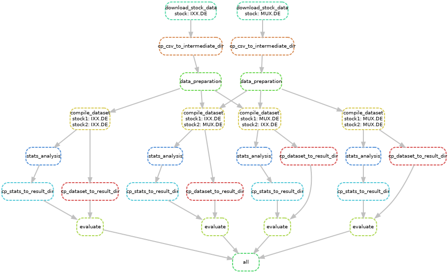

# Stock Correlation

This analysis investigates an often heard hypothesis of stock correlations: There are stocks which follow in their trends one after an other within a short time window. In this investigation, we look for such correlations and discuss whether they are predictable.

## Snakemake Workflow

The analysis consists of a several jupyter notebooks. A [snakemake](https://snakemake.readthedocs.io/en/stable/) workflow defined in the [`Snakefile`](Snakefile) and located in the same directory organizes the execution. The [`config.yaml`](config.yaml) configures relevant workflow parameters.

The following command runs the workflow.

```
snakemake --cores all
```

The workflow executes the jupyter notebooks via [papermill](https://papermill.readthedocs.io/en/latest/index.html). By convention, notebooks write their output into the same directory where they read their input data from. As a consequence, the workflow is responsible for correctly providing files before a notebook starts running.

## Configuration 

Configure relevant parameters in the [`config.yaml`](config.yaml). The files documents the parameters.

## Directories and Files

Starting from the `DATA_ROOT_DIR` defined in the `config.yaml` the workflow creates other directories. They contain stock data downloaded as `.csv` files for each ticker symbol, intermediate files and result files. The preferred data format are [`.parquet`] (https://parquet.apache.org/) files.

The following structure shows the directory tree for two stocks, indicated by symbol1 and symbol2.

```
DATA_ROOT_DIR/
├─ intermediate/
│  ├─ symbol1.parquet
│  ├─ symbol1_symbol1.parquet
│  ├─ symbol1_symbol2.parquet
│  ├─ symbol2.parquet
│  ├─ symbol2_symbol1.parquet
│  ├─ symbol2_symbol2.parquet
├─ results/
│  ├─ symbol1_symbol1_result.parquet
│  ├─ symbol1_symbol2_result.parquet
│  ├─ symbol2_symbol1_result.parquet
│  ├─ symbol2_symbol2_result.parquet
├─ stock_csv/
│  ├─ symbol1.csv
│  ├─ symbol2.csv
```

## Workflow Example

The following image depicts an example workflow for two stocks.



